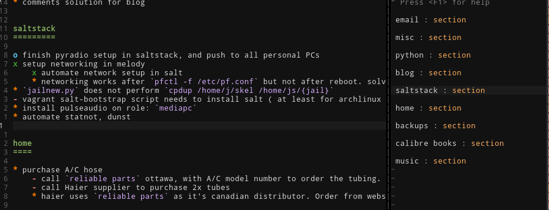

TaskMage
========

A simple plaintext task manager, allowing you to edit tasks in
plaintext lists (quick to edit, no metadata clutter), and store metadata in 
json files (for genrating reports, searching by date, etc). Inspired by git 
and taskwarrior.

Create a taskmage project, then crate/edit a ``*.mtask`` file within it.

.. code-block:: vim

    " create a new taskmage project
    :TaskMageCreateProject

    " create a new taskfile (alternatively from shell: touch file.mtask)
    :edit file.mtask

Populate it with tasks, using a format similar to ReStructuredText. 

.. code-block:: ReStructuredText

    Trip Home
    =========

    * grocery shopping
      x apples
      x oranges
      * sick supplies for Alex
        for while she isn't feeling well
      - deodorant
        
    Home
    ====

    * finish ZNC server setup
        * write saltstack recipe for ZNC server setup
        * test saltstack recipe

After completing several tasks, you can cleanup your tasklist
by archiving completed task-chains (archived if task/header and all children are complete).

.. code-block:: vim

    :TaskMageArchiveCompleted

You can compare your current tasks against completed tasks
side-by-side by looking at the archived-tasks.

.. code-block:: vim

    :TaskMageVSplit

I use git to synchronize tasks between my computers. On-disk, entries are recorded one-task-per-line
so that you can more easily resolve merge-conflicts. Occasionally, I find it useful keep a tasklist
alongside my source-tree.

|
|

.. contents:: Table Of Contents

|
|

Syntax:
=======

Tasks
-----

Tasks are treated similarly to ReStructuredText list-items, except that
additional characters are used to indicate task-status.

.. code-block:: bash

    *   # todo
    x   # finished
    -   # skipped
    o   # currently in-progress

Tasks can be divided into subtasks by indenting them under their parent.

.. code-block:: bash

    * clean kitchen
        * dishes
            * cutlery
                * spoons
                * forks
                * knives

Sections
--------

Tasks can be categorized into sections (which take the format of a
ReStructuredText header). Headers can be nested.

.. code-block:: ReStructuredText

    * fix mouse scrollwheel
    * water plants

    Tommorrow
    =========

    work
    ----

    * UI for software-updater
    * installer for software-updater 

    home 
    ----

    * christmas shopping
    * taskmage documentation

    After Tomorrow
    ==============

    * package ep110

Comments
--------

Inline comments (within tasks) are also supported. 
They are technically a part of the message of a task, but they are 
syntax-highlighted differently so that they stand out.

.. code-block:: ReStructuredText

    * do dishes  # start with forks!
                 # then continue with spoons!

    * another task

TaskMage Projects
=================

Like git, taskmage uses a directory to indicate a project-root,
and store completed task-data. 

.. code-block:: python

    /todos/
        home/
            family.mtask
            sideprojects.mtask
        today.mtask

.. code-block:: python

    /todos/.taskmage/
        home/
            family.mtask
            sideprojects.mtask
        today.mtask

Under the Hood
==============

A file you are editing that looks like this:

.. code-block:: ReStructuredText

    Trip Home
    =========

    * grocery shopping
      x apples
      x oranges
      * sick supplies for Alex
        for while she isn't feeling well
      - deodorant
        
In reality looks something like this. We use syntax-highlighting to
hide a UUID associated with each task.

.. code-block:: ReStructuredText

    Trip Home
    =========

    *{*40429D679A504ED99F97D0D16067B2B3*} grocery shopping
      x{*E061DCB183EF4C418E97DEE63332C1A0*} apples
      x{*10A71C4E3FCE439A86F1F001BD6BE99D*} oranges
      *{*C96A9133AFC448B2B295451757C5C5EC*} sick supplies for Alex
        for while she isn't feeling well
      -{*EBFEBD42B4894431A3AA048D4AED02B1*} deodorant
        

On-disk, tasklists are saved as JSON objects. Tasks modified in your
file update these JSON objects using their UUID. This serves a dual purpose of:

* keeping metadata out of the way in the tasklist
* storing metadata in an easily accessed format for reports, summaries, or batch operations.

.. code-block:: javascript

    [
      {
        "_id":      "40429D679A504ED99F97D0D16067B2B3",
        "section":  "Trip Home",
        "created":  "2017-06-11T22:40:52.460849-04:00",
        "finished": false,
        "text":     "apples",
        "status":   "todo"
      },
      {
        "_id":        "E061DCB183EF4C418E97DEE63332C1A0",
        "parenttask": "40429D679A504ED99F97D0D16067B2B3",
        "created":    "2017-06-11T22:40:52.460849-04:00",
        "finished":   false,
        "text":       "apples",
        "status":     "done"
      },
  
      //
      // ... and so on ...
      //
  
    ]

Archived tasks are stored in a subdirectory of your root-project. Beyond that,
their format is identical to active tasks in every way.
